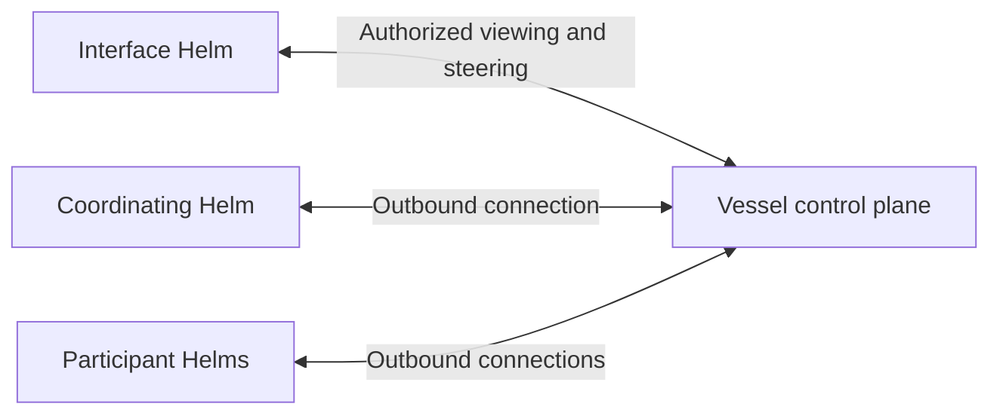

# Voyage architecture

Helm owns agent execution, local canonical state, provider credentials, policy,
approvals and tools. Vessel supplies the authenticated control plane. Helm is the
intended operator interface for both local and remote work.

## Product roles

The planned [voyage model](voyages.md) is an open-ended session across user-scoped
Helms. Interface, coordinating and participant Helms are separate roles that may
overlap. The coordinating agent can run on a remote Helm while the user opens an
interface on a workstation. No repository or component-to-machine map is required.

This is the target role/communication model, not an implemented distributed
coordinator. Vessel routes authorized work; each executing Helm enforces local
authority. Voyage persistence, shared context and coordinator handoff require
further contract design. Opening or closing an interface does not define who
coordinates or imply an execution cancellation request.

## Current local and remote execution

Local Helm supports chat, runs, sessions, terminals, todos and local subagents.
[Private managed sessions](local-managed-sessions.md) add journal-backed ownership,
exact command receipts and explicit recovery. A local session owner serializes
execution on one host; it is not a voyage-level coordinating agent.

An enrolled Helm can maintain an authenticated outbound presence connection with
`helm attachment --directory /absolute/identity connect`. Presence alone negotiates
no application capabilities and cannot dispatch work or expose sessions. See
[enrollment](attachment-cli.md) and [presence](attachment-presence.md).

An explicit `helm remote-worker` creates one new dedicated managed session and
connects outbound to Vessel. With Vessel `--remote-execution`, authenticated HTTP
clients can list/inspect it, submit turns, replay permitted events and cancel an
exact run. See [remote sessions](remote-sessions.md) for the complete current setup
and failure behavior. The unified Helm management interface and multi-Helm voyage
coordination remain planned under [#77](https://github.com/o-psi/voyage/issues/77).

## Trust boundaries

1. Provider credentials and opaque provider continuation remain on their Helm.
2. Every execution enforces its host's roots, command policy, approvals, cancellation
   and resource limits. Application policy is not an OS sandbox.
3. Enrollment, voyage scope, session sharing and approval authority are distinct.
   Neither a coordinator nor a delegate can silently widen them.
4. Helm initiates connections; no inbound Helm task/session port is required.
5. Interface disconnection, worker transport loss and process exit are distinct
   lifecycle events. Current worker transport loss cancels active work; it does not
   implement the target persistent coordinator/handoff experience.

## Local parallel agents

Helm supervises a tree of local children with explicit tasks, tool policy,
cancellation and durable records. Coding children can use isolated Git worktrees;
other children can use ordinary policy-scoped directories. This remains local
supervision, distinct from planned cross-Helm participation. See
[Parallel subagents](subagents.md) for scheduling and safety limits.

## Current management-plane surface

- `GET /health`: process liveness.
- `GET /ready`: database connection check, not remote-execution readiness.
- `GET /metrics`: whether attachment presence is configured.
- `GET /v1/diagnostics`: authenticated status and bounded current presence metadata.
- `GET /ui`: authenticated static status page; a browser console is deferred.
- Explicitly configured enrollment administration and `/v2/attachment` transport.
- With `--remote-execution`, the authenticated dedicated-session endpoints in the
  [remote-session guide](remote-sessions.md).

`voyage-protocol` supplies strict shared command, feature and event contracts.
The [attachment foundations](attachment-foundations.md) include the transactional
command/run journal. Full lifecycle, broader sharing, operator UI, scoped approvals,
services and voyage-aware coordination require further implementation and evidence.
See the [session management design](vessel-session-management.md).
