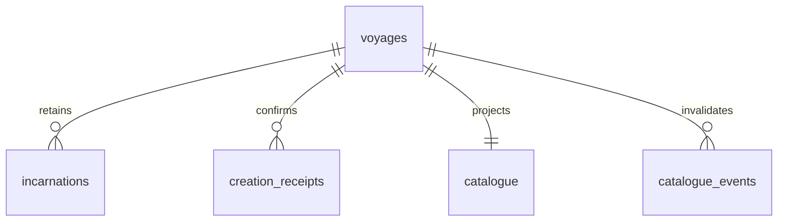

# Embedded SQLite storage

Vessel and Voyage use SQLite as a **linked library through `rusqlite`**. There is
no database daemon, SQL network endpoint or separately deployed database service.
Helm talks to Vessel through its authenticated application protocol.

Each Voyage retains its own canonical conversation database. Vessel has a separate
supervision/catalogue database. See [architecture](architecture.md) for ownership
and [current state](current-state.md) for supported runtime behavior.

## Database ownership

| Database/store | Owner | Durable contents |
| --- | --- | --- |
| `<vessel-directory>/catalogue.sqlite3` | Vessel | Voyage registrations, process incarnations, exact lifecycle bindings, creation receipts, catalogue summaries and refresh state |
| `<vessel-directory>/sessions/<uuid>/journal/journal.sqlite3` | Independent Voyage process | Conversation, runs, canonical checkpoints, exact turn receipts, decisions, configuration and cleanup obligations |
| Existing notification SQLite database | Vessel notification component | Bounded notification acceptance, payload retention, receipts and delivery state |
| Existing Helm private draft files | Helm | Unsent composer text, proposed configuration, exact creation/first-turn envelopes and pending recovery |
| Existing host account/access stores | Their existing host-local components | Provider accounts and credentials, human connections, scoped process grants, participant bindings and transfer authority |

A configuration draft is not a voyage. First send creates the durable supervision
record and then submits a turn to its independent runtime. A run ending does not
end its voyage. Disconnecting Helm does not cancel accepted work.

SQLite supports one writer at a time per database; keeping journals separate also
keeps unrelated voyages' write contention separate. See SQLite's
[embedded storage guidance](https://www.sqlite.org/whentouse.html).

## Vessel schema

The authoritative executable schema is
[`vessel/src/process/database.sql`](../vessel/src/process/database.sql).
Its repository implementation is
[`database.rs`](../vessel/src/process/database.rs). Schema version 1 contains:

| Table | Keys and relationships | Purpose |
| --- | --- | --- |
| schema_version | Singleton ID, version | Reject unsupported database versions and unrelated databases |
| voyages | Session UUID primary key | Current incarnation, workspace bytes, process disposition, name, versioned registration and update time |
| incarnations | Incarnation UUID primary key; voyage FK; session/time index | Retained launch identities, original launch command and registration data |
| lifecycle_commands | Namespace + command UUID primary key | Immutable exact request bytes for lifecycle admission and creation non-admission fences |
| creation_receipts | Command UUID primary key; voyage FK | Original confirmed creation result, including initial catalogue revision when available |
| catalogue | Session UUID primary key and voyage FK | Last summary, observed process info, file-change fingerprint, last success time, sanitized failure and next refresh deadline |
| catalogue_events | Increasing sequence; voyage FK | Bounded committed metadata invalidations, retaining the last 4096 events |
| legacy_imports | Source locator primary key | Imported registration digests and completed-import marker |

The registration JSON retains existing protocol fields, including runtime-private
transport authentication. It is private supervisor storage and is never returned
as catalogue data. Provider credentials remain in their executing-host stores;
no provider credentials or full conversation are copied into the catalogue.
Identity keys and workspace/state columns make the records queryable without
opening runtime processes. JSON receipt/registration payloads retain exact existing
protocol semantics rather than inventing a second command representation.



Lifecycle command namespaces preserve existing distinctions: ordinary command
reservations, creation-resolution intents, and confirmed non-admission fences.
An exact ID with changed bytes conflicts. Connection-operation principal bindings
remain enforced by the existing access layer; moving bytes into SQLite does not
merge human connections, process grants or participant authority.

## Per-voyage conversation schema

The existing [journal implementation](../voyage/src/attachment/journal.rs) owns
canonical transactions. Important tables include:

| Tables | What they retain |
| --- | --- |
| sessions | Session UUID, revision, canonical serialized session/history and next event sequence |
| runs | Run UUID, session FK, run record and active flag; unique active run per session |
| commands | Command UUID, digest and unique admitted run FK |
| events | Session + sequence primary key and canonical event payload |
| process_commands, process_command_bindings, process_command_tombstones | Exact process requests, authenticated bindings, receipts and transfer/deletion evidence |
| process_configuration, process_lifecycle | Saved execution configuration and archive/deletion/transfer disposition |
| process_decisions, steering | Decisions and run-bound queued/applied/rejected guidance |
| local_cleanup_obligations, process_cleanup_progress, process_session_resources, process_retained_cleanup | Outstanding cleanup, owned resources and observed versus attested outcomes |
| process_observations | Bounded monotonic public invalidations used by streaming clients |
| process_assignments, notification_outbox, notification_cursor | Delegation records and durable notification production |

Conversation messages currently live inside the canonical session JSON in the
`sessions.state` column. They are already persisted transactionally in SQLite;
this change does not split every message into a new relational table or rewrite
existing conversation journals. Full history remains available through Voyage's
bounded history/message APIs. Existing ownership locks, revision checks, exact
command bindings and atomic checkpoints remain authoritative.

## Creation and recovery

Vessel now commits a new voyage registration, its incarnation, exact creation
reservation, initial catalogue row and creation event in one transaction before
launch. Startup still runs in a separate Voyage process. Confirmed readiness is
saved as an immutable creation receipt; an exact retry returns that original
result. A stored success records creation at that time, not perpetual liveness.

Creation resolution reads retained receipts without requesting a suspended
snapshot. Missing-command resolution preserves a durable non-admission fence;
a delayed original request cannot launch after that fence. A reserved but
unconfirmed launch remains uncertain and cannot be blindly repeated.

The creation response carries a read-only journal summary when available. Helm
uses its session revision for the first turn instead of reconstructing a full
suspended snapshot. The first-turn receipt still belongs exclusively to Voyage.
Helm saves its exact envelope before sending and never automatically replays an
uncertain provider/tool effect. Creation and first-turn admission are separate
transactions across the two owning databases, not a fictitious global commit.

## Catalogue reads and freshness

Local and authorized scoped catalogue requests read persisted SQLite records;
they do not fan out runtime health/snapshot requests. A bounded background producer
refreshes up to four voyages concurrently, detects journal/lifecycle changes, and
backs off failed reads exponentially to a maximum of 60 seconds. It preserves
last-known details on failure and reports `stale` plus a sanitized error code.

The [Voyage-owned projection library](../voyage/src/catalogue.rs) opens an existing
journal read-only and selects bounded display metadata under a consistent SQLite
read transaction. It does not acquire execution ownership, initialize schema,
load provider configuration, replay commands or launch a subprocess. It reads
only when the relevant file fingerprint changes or a refresh is explicitly needed.
Names, revision/cursor, model, run outcome, message count, timestamps and lifecycle
flags are projected; transcript and tool payloads do not leave this reader.

Runtime health is observed separately and expires. Restart invalidates previous
live observations and refresh fingerprints, while retaining saved summaries.
Lifecycle operations reload registrations from SQLite under a serialization guard,
so a cancelled request cannot strand a committed incarnation in a stale memory map.

Helm uses supplied catalogue metadata for its sidebar. Full snapshots and terminal
inventory are fetched for the selected voyage; unchanged suspended entries no
longer trigger repeated catalogue-wide helper startup. Failed selected reads also
back off. Transient route failures retry read-only catalogue checks with capped
backoff while retaining the original activation and pending command identities. Live selected voyages retain event observation, with polling fallback
for peers without streams. Older peers without catalogue metadata keep the legacy
observation path. Catalogue transport remains the existing bounded listing API;
this change does not introduce a new paginated wire operation or expose the internal
catalogue event table as a public stream.

Cached summaries require the existing History right. Catalogue-only human grants
and Observe-only process grants receive the limited process listing. Current grant
scope and revocation are checked before disclosure; caching grants no new authority.
Independent full-history/detail reads continue through Voyage's authorization.

## Migration and failure handling

On supervisor startup, under its existing process lock, Vessel imports private
legacy registrations and exact command/resolution files in a SQLite transaction.
Original files are preserved. Subsequent startups use SQLite rather than reimporting
stale registration files. Runtime-readable `registration.json` files remain derived
compatibility artifacts; startup republishes them from the database so a crash
between database commit and file publication can be reconciled.

Malformed or unsafe legacy records fail migration without committing a partial
import. Operators must repair or explicitly recover those records; they are not
silently dropped. Existing authority/pairing/account stores retain their own locks
and writers and are not imported into an unused generic grant schema. A downlevel
Vessel must not be run against the migrated directory: it would write the old files
without updating SQLite. Application rollback therefore requires a compatible
binary or explicit state reconciliation, not an old binary plus stale files.

SQLite runs on bounded blocking tasks, with a two-second busy timeout, foreign
keys enabled, full synchronization and a private persistent rollback journal.
No transaction waits for a runtime process or provider. Private owner/mode,
symlink/hardlink and sidecar validation remain mandatory. Unexpected WAL state and
unsupported schema versions are refused. See SQLite's
[foreign-key documentation](https://www.sqlite.org/foreignkeys.html).

A failed commit is never reported as durable admission or successful settlement.
Exact command records and creation receipts are retained; event compaction does
not delete deduplication evidence. Full/I/O errors require explicit handling rather
than deleting the database. Use SQLite's backup API or a coordinated quiescent copy.
A backup restore cannot establish current revocation, process liveness or cleanup;
reconcile those independently before resuming execution. Keep the per-voyage
journals when backing up supervision data.

This runtime change applies to the existing Linux Vessel implementation. Linux
checks do not establish native macOS/Windows storage security. The management HTTP
`--database` option remains separate from the local supervisor's `catalogue.sqlite3`.

## Verification

Run the focused storage tests and real-process/Helm fixture:

```sh
cargo test -p vessel --locked process::database::tests
cargo build -p helm -p vessel -p voyage --locked -j 8
python3 tests/vessel_sqlite.py --bin-dir target/debug
```

The fixture uses isolated directories and synthetic local provider responses.
It checks creation revision/receipts, independent conversation persistence,
restart without provider replay, stale-detail retention, scoped disclosure and
revocation, Helm first send and conversation reselection, and a 257-entry retained catalogue with observer-start
and latency measurements. Results are recorded in
[issue #264](https://github.com/o-psi/voyage/issues/264); workspace coverage follows
[quality requirements](quality.md). These checks do not establish a deployed TLS
proxy or live provider compatibility.
